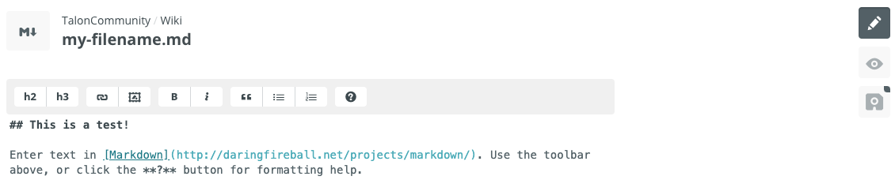
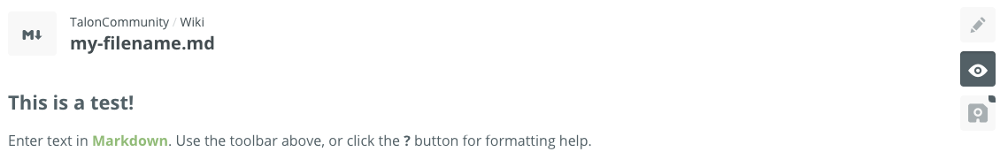

# Contributing Content
This is a wiki for the beta version of [Talon](https://talonvoice.com/), a hands-free input replacement for using a computer. These docs are rendered and deployed to:

[https://talon.wiki/](https://talon.wiki)

Join the [Talon Slack](https://talonvoice.com/chat) to find other folks interested in or using Talon. The beta version is currently only available to Talon Beta tier Patreon supporters. If you want to try out the beta, consider donating to the [Patreon](https://www.patreon.com/lunixbochs). Links to download the beta version can be found in the `@beta` channel.

## Who can Contribute
This wiki belongs to the Talon Community, and contributions are welcome from anyone. Anyone can make pull requests, and any member of the TalonCommunity GitHub organization can merge that pull request. Talon Community members can push directly to `gh-pages` branch.

## How to Contribute
Content is formatted using Markdown syntax. Check out this [Markdown Syntax Guide](https://guides.github.com/pdfs/markdown-cheatsheet-online.pdf). There are multiple ways to contribute content:

### Using Prose.io, a GitHub content editor
Links to edit content using `Prose.io` are embedded into the site in the top right corner:


Clicking these links should drop you into a content editor in your browser:



There's a preview button to see your changes rendered in markdown:



#### Images
Images can be uploaded either by dragging and dropping the image into the prose editor or by clicking the image button in the markdown editor bar. These photos will be uploaded to the `media` directory and you should see some markdown generated for you:

```

```

#### New Pages
Prose by default suggests a filename with a date, and there isn't a way currently to turn of this behavior. Please remove the date from the suggested filename, for example don't use `2020-06-16-your-filename.md` and instead name it without a date like `your-filename.md`. Remember to use the `.md` file extension. Files without the extension will not be rendered by jekyll.

#### Saving Changes
Click the save button, which will commit your changes. If you are a member of Talon Community, your changes will be committed directly to the deploy branch `gh-pages` and will show up https://talon.wiki once the site is rebuilt. If you are not a member of Talon Community, saving your changes will create a Pull Request on Github. Any member of Talon Community can merge the changes. Please ping someone on your pull request or find someone in the `@beta` or `#talon-docs` channels of the Talon Slack.

### Using GitHub UI
There are links in the top right corner of the site to edit the content in GitHub. Clicking `Add new`, for example, will drop you into a GiHub UI for adding a new file:


The GitHub UI provides an option to either commit directly to `gh-pages` branch (if you are a member of Talon Community) or make a new branch and submit a pull request, which can be merged from a member of TalonCommunity.

### Using git

#### New Pages
New pages can be added to the root directory - no need to add to any subfolder. Pages should include the `.md` file extension or they will not be rendered. For every new page, make sure to add a link to it in the sidebar `_includes/sidebar.html`:

#### Images
Add images to the `media` directory and include in markdown using the syntax:

```

```

## Deploying Changes
All changes merged to `gh-pages` branch will be automatically deployed using GitHub pages to the domain `talon.wiki`. There is some delay between merge and when site is refreshed with the new content, so expect changes to take a few minutes. If you are a member of TalonCommunity, you have write access and can merge your own changes. If

# Advanced
**If you are only looking to add content to the wiki, you should not need to do any of the following setup. This is only relevant if you want to make changes to the wiki site itself or you want to preview locally instead of using prose or GitHub UI.**

## How this Wiki is Built

This wiki is built using:
- [jekyll](https://jekyllrb.com/docs/), a static site generator
- [GitHub Pages](https://jekyllrb.com/docs/github-pages/), to host the site
- [git-wiki-theme](https://github.com/Drassil/git-wiki-theme), a wiki theme for jekyll
- [prose.io](https://github.com/prose/prose), a content editor for GitHub

The theme is built directly into the repository so we could patch any changes as needed.

## Making Custom Style Changes
This wiki is built using a custom theme, but it is possible to override any of the style in `overrides/css/custom.css`.

## Previewing Changes Locally
Follow the instructions in the [Quickstart jekyll docs](https://jekyllrb.com/docs/) to setup a Ruby environment and install bundler.  To build the site and make it available to a local server, run:

```
bundle exec serve jekyll
```

and open `http://localhost:4000` in a browser.

Some functionality, such as the editing with prose, cannot be easily tested locally.
