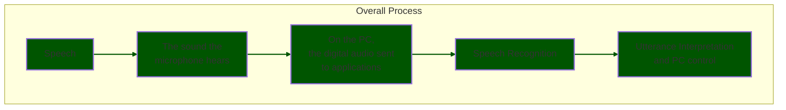
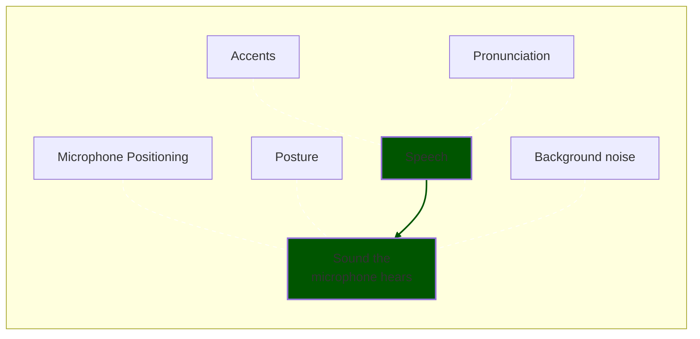
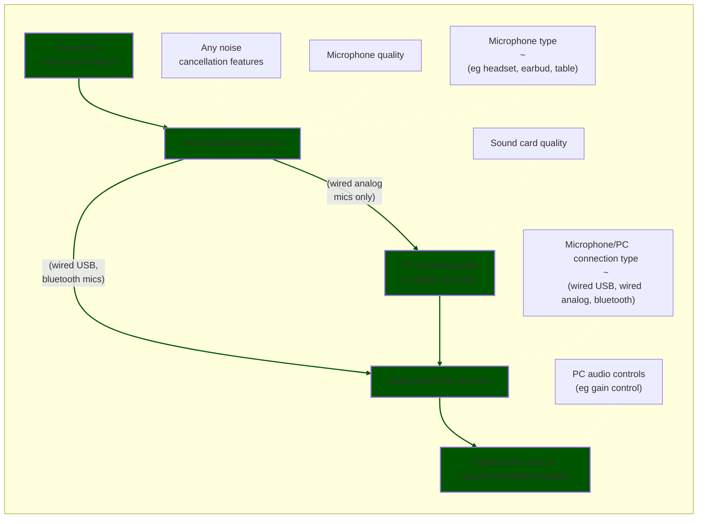
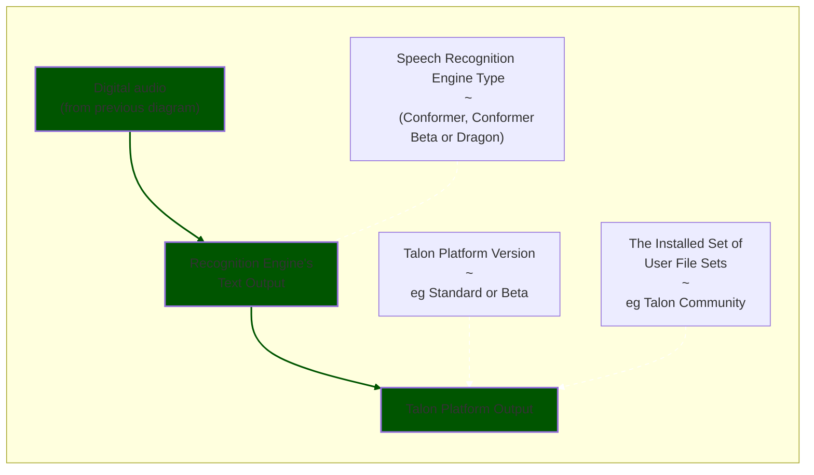

# Improving Recognition Accuracy

:::docoscope Talon Platform

:::

Improving recognition accuracy never hurts. Many people even have to tweak something to get a good experience. Here we show you what you can do.

## The Overall Process

There are many steps on the way between you speaking and what words are recognized on a PC and
what is done with those words. Improvements at any step in the process can improve your overall experience of
using speech recognition as an alternative to a keyboard.

Here is an overview of the process which is detailed in later diagrams.



## The sound the microphone hears




:::note Green & White

The green shows the main flow of information.
The white dashed arrows show elements that affect the target.

So in the above, we (ideally) want the microphone to only hear our speech.
However it is impacted by the listed items such as background noise.

:::

### Environment

A quiet room will always be better than a noisy one. A good microphone can mitigate this, but sometimes a $0 job will do. Move fans and air filters, rotate your sitting position such that air conditioning is not pointing toward the mic, close a door (and subsitute by taking more breaks for health and ventilation). Move your PC from above desk to below desk, move your PC speakers behind your mic, etc.

:::info Voice Activity Detection

For the conformer engine, the first step in speech recognition is detecting whether or not voice is present.

Background noise can really confuse the voice activity detection mechanism, it may seem like Talon is not responding at all or responding in a haphazard manner.

:::


### Keep a relaxed voice

Ensure that your voice is not tired, which will lead to poorer pronunciation.

- Drink some warm beverages throughout the day: warm water and tea are especially helpful.
- Try to speak in a natural tone as if you are talking with someone else. At first this will feel a little weird, but speaking in an unatural voice will tire you out quicker.
- Try to keep your speaking volume consistent and low, quality microphones can easily pick up any volume you talk at. Speaking with low volume should help keep you from getting tired out. You may need to increase the mic gain for optimal results.

### Pronounciation, and/or (non-native) accents

Controlling your computer by voice can be frustrating if your accent isn't recognized well; non-native speakers are especially prone to issues. While Talon's engine is improving with each version, in the meantime we can adapt our pronunciation.

[https://rachelsenglish.com/](https://rachelsenglish.com/) is an excellent resource. It features detailed videos and discussion of the mechanics behind the various sounds. At the risk of saying the obvious: you shouldn't try to change your accent if you don't want to.

### Microphone position

Ensure that the microphone is pointed at the mouth. This points the axis of maximum sensitivity toward your mouth for best voice isolation (reducing background noise). Some microphones require more careful placement than others.

Place the microphone at a consistent distance away from your mouth. 
- For headset microphones, most speech recognition documentation recommends that you place the boom of the microphone approximately one inch from your face, pointed at a side corner of your mouth. 
- For table microphones, somewhere between six and twelve inches works best (unlike a radio moderator, you do not need to eat the mic). A proper placement eliminates wind noises from breathing and loud sounds.

### Posture

Perhaps this goes without saying, but don't adopt the [thinker pose](https://en.wikipedia.org/wiki/The_Thinker).
You might think that you sound the same, but this does effect recognition accuracy.

## Digital audio sent to the speech recognition engine




### Microphone Quality

Make sure that you have a good microphone, as speech recognition software requires better hardware than is commonly built in to computers. 

:::note

Note that Talon is more sensitive to microphone quality than many other speech recognition systems so do not assume that just because, for example, Dragon works fine that Talon will.

:::

Have a look at the [hardware page](/docs/Resource%20Hub/Hardware/hardware.md) for recommendations and correct setup.

### Sound Card Quality

:::note Applies to Analog Microphones Only

This section only applies if you are using an analog microphone (typically has a 3.5 mm plug)

:::

Make sure that you have a good sound card, as speech recognition software requires better hardware than is commonly built in to computers. 

### PC Audio Controls

Audio drivers on PCs can modify the incoming audio in real time before it sends it out two applications. This includes volume and gain control.

Talon is more sensitive to microphone volume/gain than other speech recognition systems and that many apps, so you may need to adjust this carefully.

:::warning

Some applications, particularly conferencing apps like Zoom, will adjust the system microphone gain themselves, which can cause your recognition performance to tank when you're not expecting it.

Usually there is a setting to turn this off but it may take some time to track down all the apps that do it.

:::


## Speech recognition and PC control



### Some commands are barely ever recognized, or confused for another command

If only a few specific commands give you trouble, change those command words! Commands are almost exclusively mapped in `.talon` files: search for all occurrences of those words, and replace them with a word of your choosing: select one that is easy to pronounce, is not too similar to anything else, and is recognized well for you.

Some important commands are specified in `.talon-list` files, like the alphabet.

_Example:_ If the `close` in `tab close` does not work for you (but `tab open` etc. do), try out `tab wipe` or `tab quit` instead.

_Example:_ Your `zip` (letter Z) is always understood as `sit` (letter I), change `sit` to `ivy`, or alternatively change `zip` to `zone`.
See the section below on [alphabet alternatives](#alternatives-to-the-default-alphabet) for more examples.

### Talon cuts me off mid-command or mid-sentence

Talon lets you configure how long it will wait after you stop speaking before trying to interpret your command. As of March 2021, the default is 0.3 seconds; earlier versions had a default of 0.15 seconds. If you find that Talon is frequently cutting you off mid-command, you may want to try one or more of the following:

- Prepare your command in full before voicing it. This will help you speak fluently.

- Speak faster, especially after consonants like "p" that involve stopping airflow. In utterances like "stop it", there is a natural pause between "stop" and "it". Some people have just slightly longer stops than others, but can avoid it when preparing to talk fluently.

- Increase Talon's wait time. This has the disadvantage of making all commands react slower, but it _can_ eliminate the cutoffs. Do this by adding a `settings.talon` file to your user directory with the following content:
  ```talon
  settings():
      # minimum silence time (in seconds) before speech is cut off, default 0.3
      speech.timeout = 0.4
  ```
  Start with the value of 0.4, just slightly higher than the default, and increase only if necessary.

### Talon responds inconsistently or with a delay

Talon only processes your speech after its voice activity detector (VAD) detects silence of the length specified by `speech.timeout` above.

This issue is sometimes caused by background noise or non-speech sounds (e.g. breathing) being picked up by your microphone. To confirm this is happening, ensure Speech Recognition > Save Recordings from the Talon menu is checked, then reproduce the problem. Each utterance is saved to a separate FLAC file in the `recordings` folder inside the Talon home folder (Scripting > Open ~/.talon from the Talon menu). If the recordings seem longer than you expect, listen to them carefully or open them in an audio editor to see what is being recorded other than your voice.

If recordings appear to be the correct length, Talon may be stuck due to a long-running voice command or callback. Look in the [Talon log](/docs/Resource%20Hub/Troubleshooting/basic-issues.md#check-the-talon-logs) (Scripting > View Log from the Talon menu) for lines containing `[watchdog]` and `(stalled)`. If these don't make any sense to you, share your log on the Talon Slack.

### Help improving the Talon recognition engine

This will not help you today, but instead help to improve the talon engine for all of us in the future. You can do this by providing speech (and noise) samples:

- [Talon Speech Collection](https://speech.talonvoice.com/)
- [Talon Noise Collection](https://noise.talonvoice.com/)

:::note Don't Say Punctuation

When providing speech samples, don't speak out the punctuation. For example, one of the sample sentences is:

```
There is, according to legend, a boiling pot of gold at one end.
```

When reading it out, do not say the words "comma" or "full stop"

:::

### Alternatives to the default alphabet

Speakers of non-rhotic dialectics of English (i.e. your 'r's don't sound like an American's) may find it helpful to change the alphabet. The following is a list of alternatives users mentioned on Slack. Say `customize alphabet` to edit spoken forms for the alphabet.

| [Talon Community](https://github.com/talonhub/community) | alternative |
| -------------------------------------------------------- | ----------- |
| air                                                      | arch        |
| bat                                                      | batch       |
| bat                                                      | bill        |
| each                                                     | birch       |
| fine                                                     | faint       |
| harp                                                     | ham         |
| look                                                     | little      |
| odd                                                      | oink        |
| odd                                                      | orange      |
| pit                                                      | pink        |
| quench                                                   | queen       |
| sit                                                      | ivy         |
| sit                                                      | ice         |
| jury                                                     | jail        |
| jury                                                     | judge       |
| jury                                                     | jane        |
| made                                                     | met         |
| whale                                                    | wet         |
| whale                                                    | whip        |
| zip                                                      | zone        |
| zip                                                      | zoo         |

### Alternatives for modifier keys

The default words for some modifier keys are designed to match the labels on the keys themselves, but are not always efficient to say or can be misrecognized depending on your dialect/speech pattern. The following is a list of alternatives other Talon users have used. Note that community contains one `modifier_key.talon-list` file for Windows/Linux and one for Mac, since the modifier key names differ.

| [Talon Community](https://github.com/talonhub/community) | alternative |
| -------------------------------------------------------- | ----------- |
| alt                                                      | alter       |
| control                                                  | troll       |
| shift                                                    | sky         |
| super (Windows key)                                      | win         |
| command                                                  | man         |
