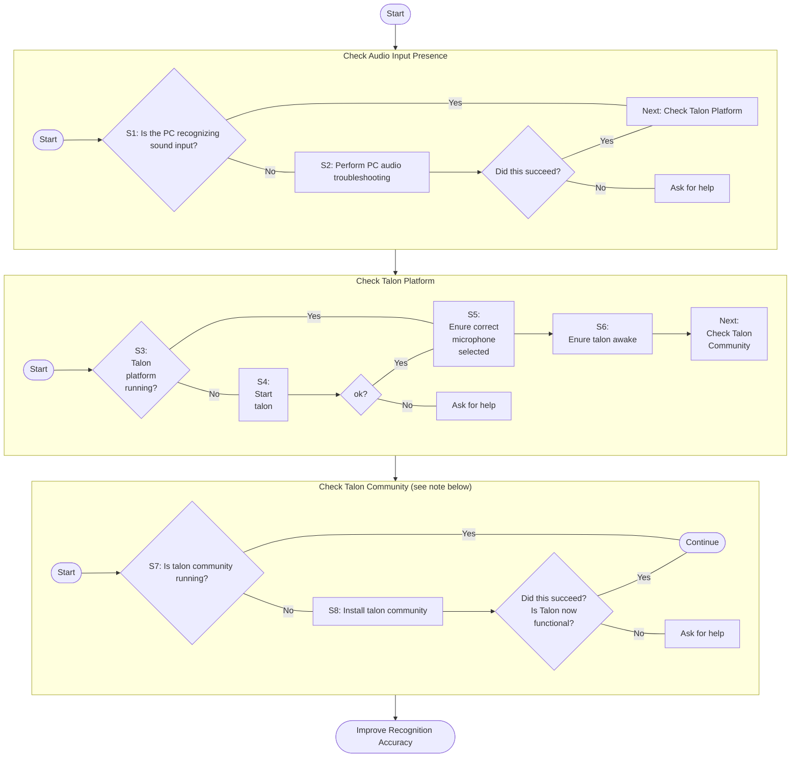

# Basic Issues

## Nothing Happens When I Speak

If you are testing your setup with one of the [basic commands](/docs/Basic%20Usage/basic_usage.md) and getting no response at all, first check a few fundamentals to help focus the troubleshooting. There are a number of issues at different layers of the setup that could be causing the problem. Your first few steps should help narrow the focus.

If talon does respond to your voice, but you aren't happy with it accuracy, then see the separate page on [improving recognition accuracy](/docs/Resource%20Hub/Speech%20Recognition/improving_recognition_accuracy.md).
That would be a useful read if talon seems to be behaving in a flaky fashion.

### Getting talon working functionally

:::note Check Talon Community

To do anything at all, a functioning user file set must be installed.
Talon community is one such user file set, and is recommended for beginners.
Many sections of this wiki is specific to the talon community user file set.

If you are using a different user file set, then this section still applies,
but you will need to check the documentation for that file set to find the specifics.

:::

:::tip

Once you have completed the steps above and talon is working functionally, you can attempt to
[improve the recognition accuracy](/docs/Resource%20Hub/Speech%20Recognition/improving_recognition_accuracy.md).

:::

### S1: Is the PC Is Recognizing Sound Input?

Your microphone is critical to your setup. If your microphone isn't working, then none of your voice commands will either. Testing this piece early may save you some time and help narrow down your troubleshooting to either hardware (microphone, audio interface, cables, etc) or software (talon, talon configuration, speech engine, etc).

Check that your computer is using the correct microphone and receiving sound input.

Mac

Open System Preferences > Sound > Input. Check that the correct input device is selected and speak into the microphone. Watch the Input level as you speak; you should see the level rising and falling.

Windows

Select Start > Settings > System > Sound. In Sound settings, go to Input > Test your microphone. Verify that the correct input device is selected and speak into the microphone. Look for a blue bar that should rise and fall as you speak.

### S2: Tips for PC audio troubleshooting

If you are not receiving any sound input, check your ancillary microphone equipment (cables, interfaces, preamps, etc.).

- Ensure your microphone is not muted.
- Check your cables and connections.
- Check your adapters and/or audio interfaces if you are using them. Examples: Shure X2U XLR-to-USB signal adapter or the DPA d:vice mobile audio interface. Check that they are connected properly and check any settings on the device, e.g., volume, gain, etc.

### S3: Check that Talon Platform is Operational

Look for the Talon icon in the menubar.

Mac

Talon's icon should show up in the menu bar in the upper right corner of your screen:

### S4: Make the Talon Platform Operational

:::docotodo

:::

### S5: Enure correct microphone selected

:::docotodo

:::

### S6: Enure Talon Awake

:::docotodo

:::

### S7: Is talon community running?

:::docotodo

:::

### S8: Install talon community

:::docotodo

:::

## TODO

:::docotodo

Incorporate the following suggestions from https://github.com/TalonCommunity/Wiki/pull/312#issuecomment-2453041850

:::

- Note that Talon is more sensitive to microphone volume/gain than other speech recognition systems and that many apps, particularly conferencing apps like Zoom, will adjust the system microphone gain themselves, which can cause your recognition performance to tank when you're not expecting it — usually there is a setting to turn this off but it may take some time to track down all the apps that do it.
- Explain the general behavior of how Talon chops up audio into utterances, both the benefits (reduced CPU consumption, command chaining) and the downsides (if the voice activity detector doesn't work in your case it will seem like Talon is not responding at all)

## Talon Crashes During Use

Talon should recover from most errors itself, but if it crashes please report it in the Talon Slack with the output log.
