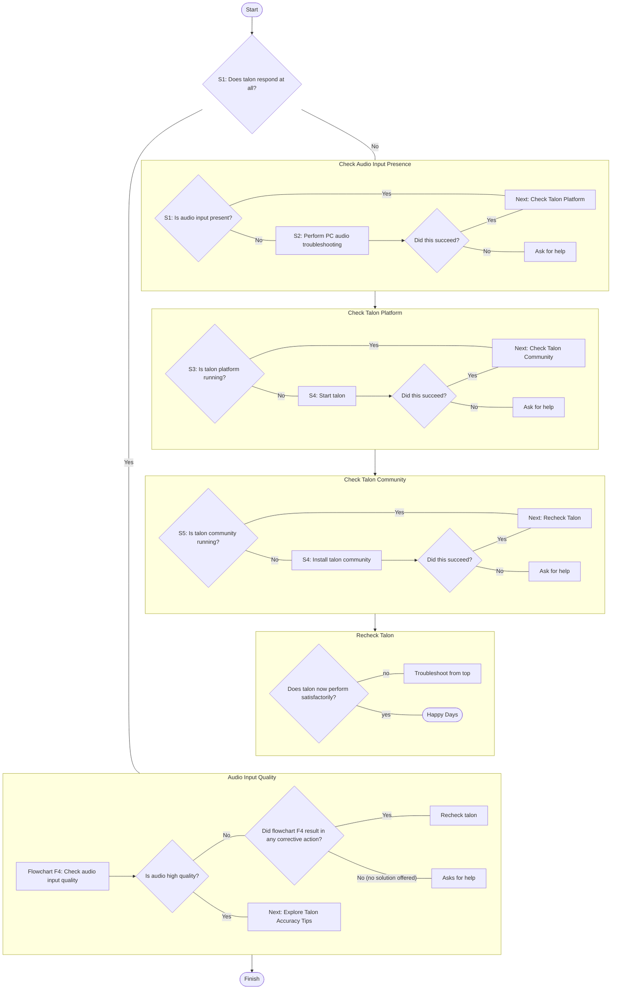

# Basic Issues

## Nothing Happens When I Speak

If you are testing your setup with one of the [basic commands](/docs/Basic%20Usage/basic_usage.md) and getting no response at all, [follow this flow chart to start off with](./nothing-happens-when-i-speak.md).

## TODO

:::docotodo

Incorporate the following suggestions from https://github.com/TalonCommunity/Wiki/pull/312#issuecomment-2453041850

:::

Probably the piece that I think is most important to include is a standard list of troubleshooting instructions to use when "Talon doesn't understand me or is behaving in a flaky fashion". Some specific suggestions:

- Check for background noise as this can really confuse the voice activity detection.
- Note that Talon is more sensitive to microphone quality than many other speech recognition systems so do not assume that just because, for example, Dragon works fine that Talon will.
- Note that Talon is more sensitive to microphone volume/gain than other speech recognition systems and that many apps, particularly conferencing apps like Zoom, will adjust the system microphone gain themselves, which can cause your recognition performance to tank when you're not expecting it — usually there is a setting to turn this off but it may take some time to track down all the apps that do it.
- Explain the general behavior of how Talon chops up audio into utterances, both the benefits (reduced CPU consumption, command chaining) and the downsides (if the voice activity detector doesn't work in your case it will seem like Talon is not responding at all)

:::docofeedback

Is at worth considering consolidating some of the suggestions on this page together with
[improving accuracy](/docs/Resource%20Hub/Speech%20Recognition/improving_recognition_accuracy.md).

Could be a great candidate for a flow chart

:::

## Talon Crashes During Use

Talon should recover from most errors itself, but if it crashes please report it in the Talon Slack with the output log.
