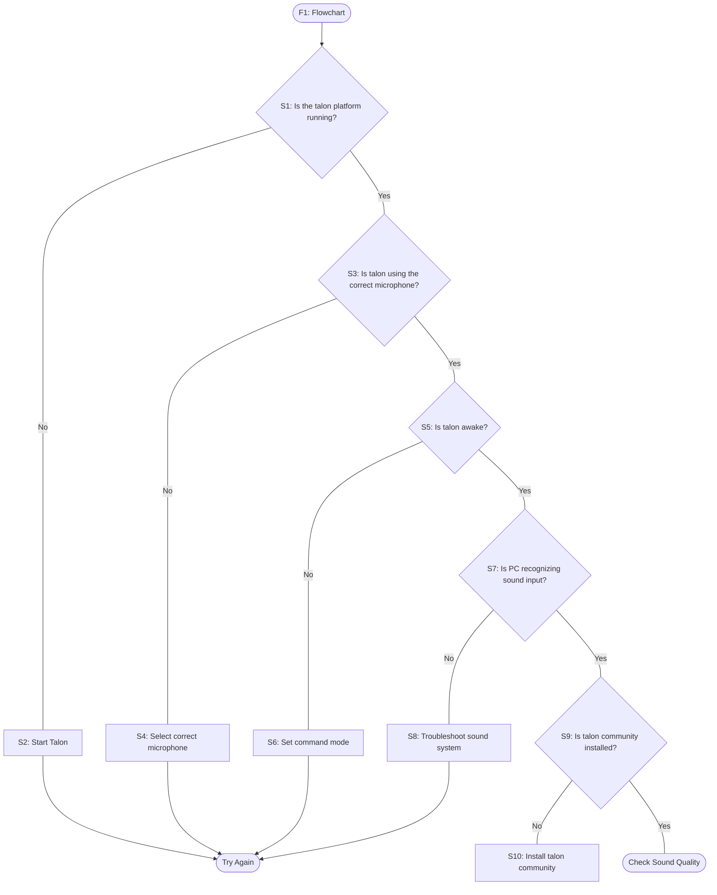

# Nothing Happens When I Speak

If you are testing your setup with one of the [basic commands](/docs/Basic%20Usage/basic_usage.md) and getting no response at all, first check a few fundamentals to help focus the troubleshooting. There are a number of issues at different layers of the setup that could be causing the problem. Your first few steps should help narrow the focus.

## F1: Flowchart

## S3: Check that Talon is using the Correct Microphone

You can check that Talon is using the correct microphone by clicking the Talon icon in the menu bar.

Mac

Talon's icon should show up in the menu bar in the upper right corner of your screen:

You can also check which which microphone is selected by looking in the talon logs, which are located in `~/.talon/talon.log`. Look for a log that looks like this:

`2020-03-04 15:27:53  INFO Activating Microphone: "Yeti Nano Analogue Stereo"`

If it's the wrong one, use the menu in the app tray to change it.

## S5: Check that Talon is Awake

When Talon is running, it will be in one of a few different [modes](/docs/Basic%20Usage/basic_usage.md). One of these modes is a `sleep` mode, which will put Talon in a dormant state where it is listening but not responding to commands. While asleep, Talon will only respond to a minimal set of commands, such as `talon wake`, which will put Talon out of sleep and enable Talon to respond to commands.

If you are trying to use Talon commands and Talon is not responding, make sure Talon is not in sleep mode. The Talon icon in the menubar provides some visual cue as to what mode Talon is in:

Mac

| Talon Is Listening                                                                                                                          | Talon Is Not Listening                                                                                                                       |
| ------------------------------------------------------------------------------------------------------------------------------------------- | -------------------------------------------------------------------------------------------------------------------------------------------- |
|  |  |

