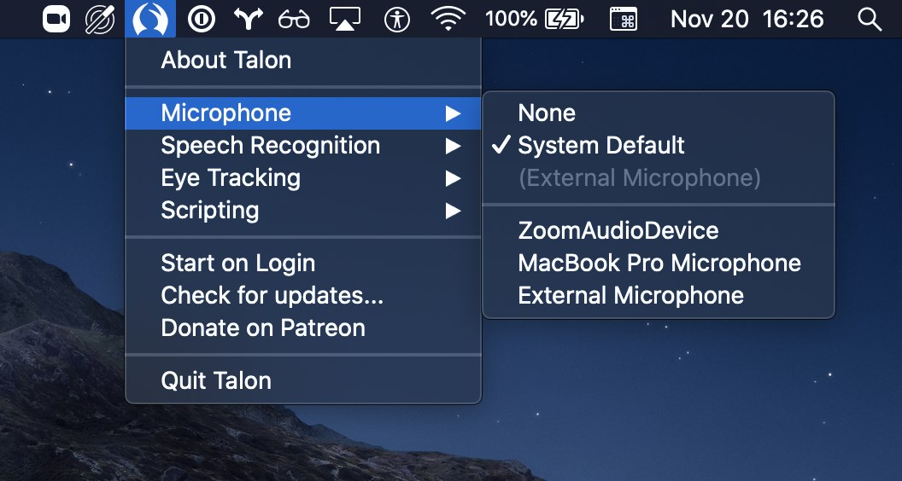

# Getting Started

Our first goal is that you have a working Talon installation and configuration, such that when you say out loud "phrase hello world", Talon will literally type "hello world" into the currently open window.  To get to that using the public version of Talon, you need to follow a few steps:

1. Download Talon from [talonvoice.com](https://talonvoice.com/). There are downloads for Mac, Linux, and Windows.
2. Download a [configuration set](https://talon.wiki/getting_started/#configuration), to make some commands available.
3. Choose a [speech recognition engine](https://talon.wiki/getting_started/#speech-recognition-engine).
4. Optionally, join the [Talon Voice Slack](https://talonvoice.slack.com), where you can ask for help, tips, and chat with other Talon users.

If you would rather use the beta version, which comes with earlier access to new features and higher priority support, then instead do the following:

1. Sign up for the [beta tier at lunixboch's patreon](https://www.patreon.com/join/lunixbochs).
2. Join the [Talon Voice Slack](https://talonvoice.slack.com), and message `@aegis` for access to the #beta channel.
3. In the #beta channel's pinned messages, find the download for your OS, and download and install it on your computer.
4. Perform steps 2-3 from the above list.

We describe below: what's the difference between public and beta, and what exactly is going on at each step?


## Public vs. Beta vs. Legacy

Talon has two mostly compatible current versions: public and beta. The public release is free, while the beta version requires a $25/month subscription to the [developer's patreon](https://www.patreon.com/join/lunixbochs). The beta version has earlier access to new features and higher priority support. For example, as of September 2020, the beta version supports `sconv-b5`, a more powerful speech recognition model based on neural nets; and `webspeech`, the option to use your browser's speech recognition engine for dictation.

There is also a legacy version of Talon for Mac only that is no longer actively developed, but still functioning. For those considering upgrading from legacy, the new version has a new configuration syntax, supports more operating systems, and has integration with the new wav2letter voice engine, an alternative to Dragon created because [Dragon was discontinued for Mac](https://www.nuance.com/dragon/support/professional-individual-for-mac-eol.html#). However, the new API is not backwards-compatible, so you will have to change your configuration files.


**To get access to the beta:** After [joining the beta tier](https://www.patreon.com/join/lunixbochs) and [Talon Voice Slack](https://talonvoice.slack.com), write a message to `@aegis` requesting access to the `#beta` channel.  He is the developer of Talon, and will grant you access as soon as he's back at work on Talon.


## Installation

Click the appropriate download link for your OS on talonvoice.com. (For the beta, find the latest download for your OS in the #beta channel's pinned messages.) Once the download finishes:

**Mac**
: Open the `.dmg` and drag&drop it to your Applications.

**Linux**
: Extract the `.tar.xz` file to a directory of your choosing, for instance `~/bin/`.  This will make Talon available for starting via `~/bin/talon/run.sh`.

**Windows**
: Extract the `.zip` file to `C:\Program Files\Talon`; you can start Talon via `C:\Program Files\Talon\talon.exe`.  Alternatively, if you want to use Dragon (or continue to use it), follow the instructions on [Installing Dragon](/InstallingDragonWindows) and [Setup Talon on Windows 10 with Dragon](/SettingUpTalonWindows10Dragon). (TODO: This doesn't seem to be up to date with the public version, where the default download is just a single executable.)

We still need to set-up a speech recognition engine and a talon configuration before are ready to go!


## Configuration

Talon does not come with voice commands or eye-tracking out of the box - you must install some configuration scripts into your `~/.talon/user` directory (that is `C:\Users\<username>\AppData\Roaming\talon\user` on Windows). To start out, we strongly recommend that you use the [knausj_talon](https://github.com/knausj85/knausj_talon) repository. The whole wiki assumes this repository is used, if not otherwise noted.

On **Linux/Mac**:
```
mkdir -p ~/.talon/user
cd ~/.talon/user
git clone https://github.com/knausj85/knausj_talon.git knausj_talon
```

On **Windows**:
```
md "%APPDATA%\Talon\user"
cd "%APPDATA%\Talon\user"
git clone https://github.com/knausj85/knausj_talon.git knausj_talon
```

If you don't have `git` available, and do not want to install it, download the [zip archive of knausj_talon](https://github.com/knausj85/knausj_talon/archive/master.zip) and extract it to the correct folder.

One final step before we can test out Talon.


## Speech Recognition Engine

Talon uses a speech recognition engine that translates voice audio to text. There are multiple options for speech engines, and you will need to choose one. **Starting out:** Only if you are already using Dragon, you might want to start out with Dragon. Otherwise, Talon's own engine _wav2letter_ is recommended.

**Dragon set-up**: If you have Dragon installed, ensure that it is running, and is actively listening to your microphone.  Talon will automatically recognize Dragon and use it.

**Wav2Letter set-up**: Follow the [wav2letter instructions in the the Talon docs](https://talonvoice.com/docs/#wav2letter-setup): download and extract the contents of [this zip file](https://talonvoice.com/dl/talon-w2l-small3-dslm-en_US.zip) into your talon directory, then everything is ready to go.


## Testing out the basics

Now start/restart Talon. If you are on a Mac, Talon's icon should show up in the menu bar in the upper right corner of your screen:


If it's not there, recheck the installation, and if all seems in order, ask for help in #help.

Try a few basic commands, like "help alphabet" and "help close". That should open and close a window showing you Talon's spelling alphabet. Or open any text editor of your liking, and say "phrase hello world". Talon should type `hello world` into the text editor.  You can also try saying

- "enter" (which presses Enter)
- "air bat cap" (which types `abc`)

If the voice commands do nothing, the culprit could be the microphone setting.  A click on the Talon icon will open a menu where you can check that the "Microphone" selected is the correct mic. This is what that menu looks like on Mac:



Make sure your microphone is not muted, and that the gain (or volume slider) of the mic is not too low. Confirm that your computer is getting microphone input and the volume isn't too low.

**Mac:**

Open System Preferences > Sound > Input. Watch the Input level as you speak in to the microphone. If you see the level rising and falling as you speak, your microphone is working properly.


**Windows:**

Select Start > Settings > System > Sound. In Sound settings, go to Input > Test your microphone and look for a blue bar that rises and falls as you speak into your microphone. If the bar is moving, your microphone is working properly.


Should that not help, check out [Troubleshooting](/troubleshooting), and ask for help in #help.

TODO: per-OS guide plus dragon specifics on how to check for correct microphone.


## Basic Usage

The examples below are just a very small selection of common commands for working with apps, tabs, media, mouse, etc that should help you be productive with Talon right away.  These are based on the [knaus_talon](https://github.com/knausj85/knausj_talon) repository (see [Configuration Setup](/getting_started#configuration)). These commands may vary depending on your individual setup.


### Command history

`command history`
: Toggles the command history display, which shows the last few commands as Talon understood them; if you're not sure what Talon is doing, or if it understood you correctly, this is how to check it.


### Show available comands

`knausj_talon` has an integrated help.  It can show you a list of all defined commands, or just all commands that are available now.

`help alphabet`
: show the spelling alphabet for pressing individual keys

`help context`
: show all defined commands

`help active`
: show all currently available commands

`help next`, `help previous`
: go to the next or previous page of help items if there are a lot

`help close`
: hide any open help window again


### Switch between modes

Talon has three basic modes by default: command, dictation, and sleep.

In **command mode**, your speech will be interpreted as commands by default. In **dictation mode**, your speech will be transcribed as plain text by default (although with some commands, like "comma" etc. for punctuation), similar to traditional speech recognition systems. In **sleep mode**, Talon will do nothing until it hears a commands that wakes it up.

There are currently no visual cues about the current mode. You can tell which mode you're in by running commands and seeing if they are transcribed literally.

`dictation mode`
: switch to dictation mode

`command mode`
: switch to command mode

`talon sleep`
: go to sleep, stop processing commands

`talon wake`
: wake up and return to previous mode


### Open and switch between windows in apps such as Chrome

```
window new
window next
window last
window close
```

### Working with applications

```
focus "app name"     (say "focus chrome" for example, to switch active window to chrome)
running list         (see all active applications)
running hide         (close the list of active applications)
```

If you are on Ubuntu or another Gnome-based Linux distribution, `focus` might not work consistently across different workspaces, popping up a notification rather than actually switching focus. [This extension](https://extensions.gnome.org/extension/1005/focus-my-window/) may help.

### Working with tabs

```
tab last
tab next
tab close
tab reopen
(page | scroll) up
(page | scroll) [down]
```

### Working with media

```
mute
play next
play previous
(play | pause)
```

### Working with the Tobii eye tracker

```
control mouse (say "control mouse" to toggle on/off Tobii moving the mouse)
run calibration (say "run calibration" to start Tobii calibration)
```

### Working with text

```
copy that
cut that
paste that
```

### Working with the mouse and scrolling

[How to click with the pop sound](/scripting_and_configuration#pop-to-click)

```
dubclick (to double left click)
righty (to right click)
(page | scroll) up
(page | scroll) [down]
wheel down
wheel tiny [down]
wheel downer
wheel up
wheel tiny up
wheel upper
wheel gaze (for scrolling down) (this seems like it would use the Tobii eye tracker but it does not)
wheel stop
wheel left
wheel tiny left
wheel right
wheel tiny right
curse yes (shows cursor)
curse no (hides cursor)
drag
```


## Next Steps

Once the basics somewhat work for you, you'll likely want to improve your experience using Talon:

* [Improve Recognition Accuracy](/improving_recognition_accuracy): Better accuracy never hurts. Many people have to tweak something.
* Check the [advanced talon collection](/advanced_talon) for alternative speech recognition engines, configurations, and other stuff.
* [Unofficial Talon Docs](/unofficial_talon_docs): learn about how to configure talon to your liking.
