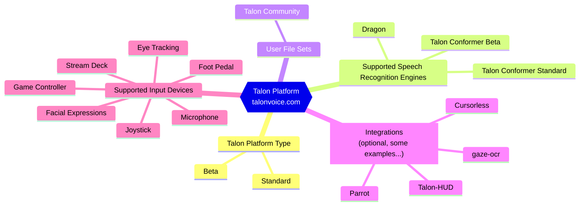

# Welcome to the Talon Community Wiki!

## What is Talon

[Talon](https://talonvoice.com) is a hands-free input replacement for the keyboard and mouse. Talon enables people who have limited use of their hands or want to stop using their hands to write code, play video games, and in general have unrestricted use of their computer. Whether you are here because you have an injury, want to prevent an injury, or are just interested in voice tech, we welcome everyone.

Talon is free to use and ongoing development is made possible by [donations on Patreon](https://www.patreon.com/lunixbochs).

---

## Talon Landscape

---

## Documentation Scope

To use talon, the talon platform needs to be installed.
If you are a beginner then it is recommended that you additionally install the talon community user file set.
If you do so, then everything in this wiki is relevant to you.

These sections will be highlighted as:

  

    [SCOPE]: TALON COMMUNITY USER FILE SET
  

### Advanced Users

If you are an advanced user and have decided to install a different user file set, then not all parts
of this wiki is relevant. Those that are will be highlighted as follows.

  

    [SCOPE]: TALON PLATFORM
  

---

## Goal of this Wiki

The goal of this wiki is to provide information and documentation for the users of Talon. As the software is under rapid development, this wiki is in a constant state of "work in progress". Some of this content exists temporarily until the official Talon Docs are created.

---

## Wiki Navigation

| If you are looking for:                                    | See:                                                                                                                       |
| ---------------------------------------------------------- | -------------------------------------------------------------------------------------------------------------------------- |
| Videos of Talon in use                                     | [Video Demos](/Resource%20Hub/talon_related_resources)                                                                     |
| Help with deciding on a microphone or eye tracker          | [Hardware](/Resource%20Hub/Hardware)                                                                                       |
| Installing and getting started with Talon                  | [Installing Talon](/Resource%20Hub/Talon%20Installation/installation_guide), [Getting Started](/Basic%20Usage/basic_usage) |
| How to customize Talon, obtaining additional functionality | [Basic Customization](/Customization/overview), [Integrations](/Integrations)                                              |
| Troubleshooting help                                       | [Troubleshooting](/Resource%20Hub/Troubleshooting/basic-issues)                                                            |
| Answers to frequently asked questions                      | [FAQ](/Help/FAQ)                                                                                                           |

:::tip Talon Slack

Talon has a [Slack community](/Help/talon-slack) for users to get help, ask questions, and meet one another. This is the most efficient way to get questions answered if they are not covered in this wiki.

:::

---

# Contributing

This wiki is maintained by the members of the Talon community (i.e., anyone who uses Talon). Contributions are welcomed and appreciated. See the [Contributing](https://github.com/TalonCommunity/Wiki/blob/main/CONTRIBUTING.md) documentation. Please keep in mind our [Code of Conduct](https://github.com/TalonCommunity/Wiki/blob/main/CODE_OF_CONDUCT.md).
