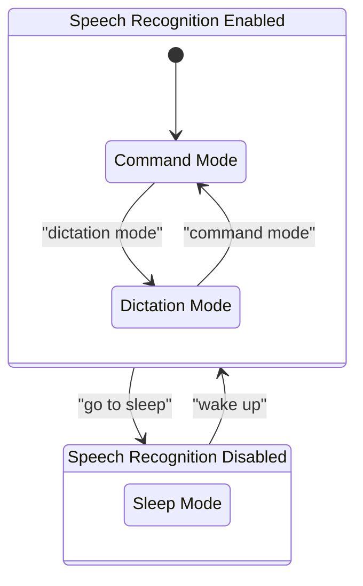

# Things to Do

Put references in each of the community library files (talon and python files) to the relevant part of this documentation
so that developers changing functionality will know where the documentation needs to be changed.

For example, in:
`C:\Users\ronny\AppData\Roaming\talon\user\talon-community\plugin\mouse\mouse.talon`

At a comment to say that the documentation is at:
`D:\github\talon-community-wiki\docs\Basic Usage\pc-control.md`

---

In the readme file, what should be done with these types of references:

```
C:\Users\ronny\AppData\Roaming\talon\user\talon-community\README.md

Formatter names (snake, dubstring) are defined `[here](core/text/formatters.py#L245)`. Formatter-related commands are defined in `[text.talon](core/text/text.talon#L8)`.

There could be useful information in there, even though I'm hoping that most of the content of that read me will be deleted
 as the information the useful information has been included in the wiki and should not be duplicated in the readme.

Check the original version of that file as I deleted some of those references before thinking that there was useful info in there.
```

### what to do with the "user." terminology in this wiki

Remove user. from user level documentation...is any disadvantage in doing that?
For example, will it make it more difficult for users to understand what is displayed in help popups

### Is at okay to use mermaid given the vulnerabilities listed during installation:

```
C:\Users\ronny> C:\Users\ronny\AppData\Roaming\talon\user\talon-scripts\build-kb\Talon community wiki start.ps1

added 93 packages, and audited 1311 packages in 23s

319 packages are looking for funding
  run `npm fund` for details

19 vulnerabilities (2 low, 17 high)

To address issues that do not require attention, run:
  npm audit fix

To address all issues possible (including breaking changes), run:
  npm audit fix --force

Some issues need review, and may require choosing
a different dependency.

Run `npm audit` for details.

D:\github\talon-community-wiki [restructure ≡ +0 ~3 -0 !]>
```

### Get mermaid working?



### zip versus git

The readme discourages users from installing by downloading the zip file and recommends using git instead.

I've changed this to a neutral approach of explaining the advantages and disadvantages of each method.

### consolidating descriptions between the library read me documentation and that here in the wiki

For example, the library read me has a section called "💡 Tip: Overriding cleanly", and this wiki has
similar information in a section called "Overriding existing voice commands"

### Explain generation of images from graphml files

Using: https://www.yworks.com
https://www.yworks.com/yed-live

# core

This folder contains `edit_settings.talon`, which has a command to open various [settings](https://github.com/talonhub/community?tab=readme-ov-file#settings) files. As an overview of what commands the subfolders contain:

- `homophones` has commands to replace words with their homophones

- `app_switcher` does not have commands but has the implementation of functions that allow for switching between applications
- `modes` has commands for switching between dictation, command, and sleep mode, as well as for forcing a certain [programming language](https://github.com/talonhub/community?tab=readme-ov-file#programming-languages) mode
- `screens` has a command for talon to show the index associated with each of your computer screens for the sake of moving windows to different screens
- `snippets` has commands for inserting snippets of code for various languages
- `text` has commands for inserting and reformatting text
- `vocabulary` has commands for adding new words to be recognized and for having certain words automatically by replaced by others
- `websites_and_search_engines` has commands for opening websites, following links, and making browser searches
- `windows_and_tabs` has commands for tab and [window management](https://github.com/talonhub/community?tab=readme-ov-file#window-management), launching and switching between different applications, and snapping application windows to different locations on the screen

Commands for enabling languages are defined in `[language_modes.talon](core/modes/language_modes.talon)`.

# Directory Structure Diagrams

https://tree.nathanfriend.com

```
talon
	user
		community
			core
				homophones
					homophones.csv
				app_switcher
					app_name_overrides.linux.csv
					app_name_overrides.mac.csv
					app_name_overrides.windows.csv
			settings
				abbreviations.csv
				file_extensions.csv
				words_to_replace.csv
```

```
talon
	user
		community
			settings
			settings.talon
	talon.log
```

```
talon
	user
		community
		cursorless-talon
		curserless-settings
		my-talon
```
# Do we need to look at all of the files referenced

supported_csv_files

